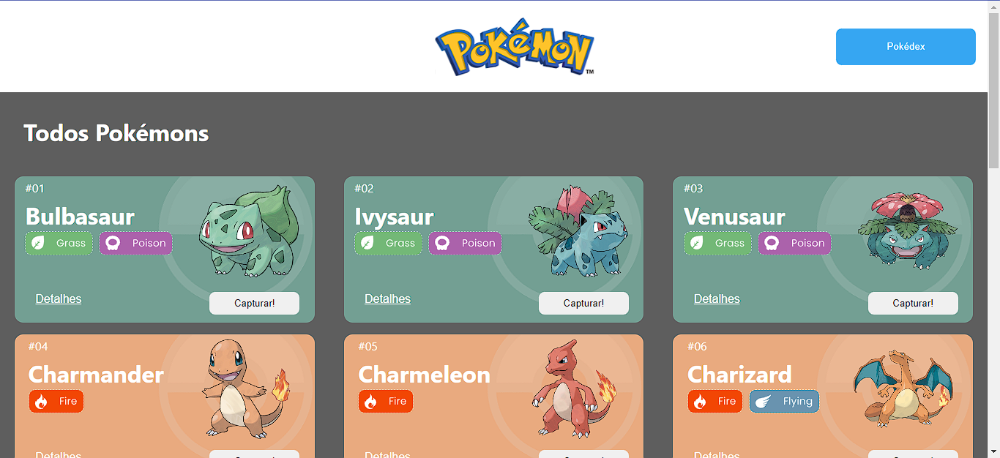
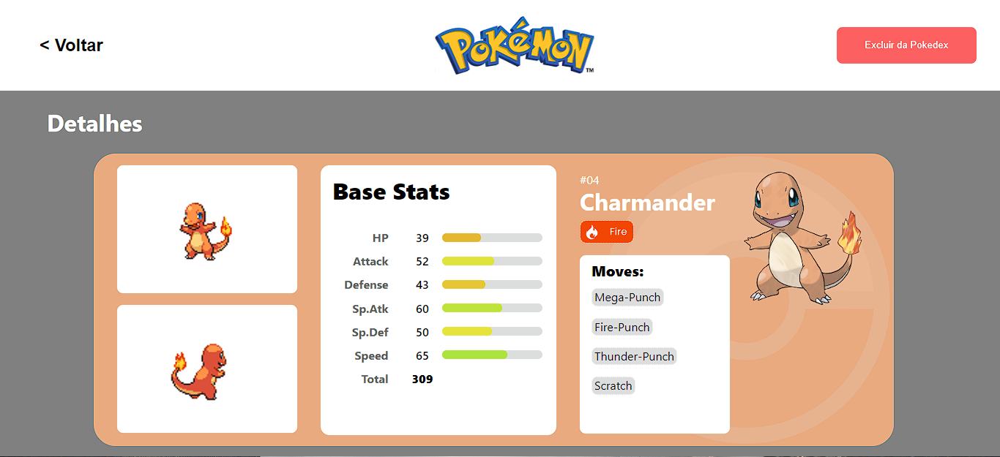
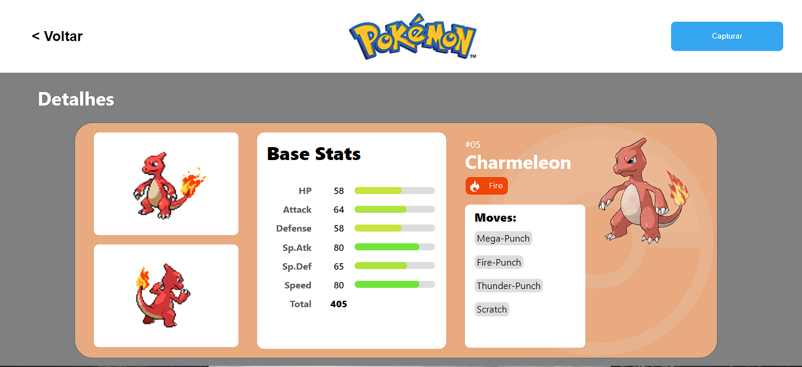

# **Projeto React e API's - Pokédex**


O Projeto React e APIs é um site de pokémons que possui três páginas: Home, Pokedex e Detalhes. 

Este projeto terá como fonte de dados  a [Poke Api](https://pokeapi.co/ "Poke Api"), uma Api pública.

Os conteúdos principais são:

- Integração de APIs
- React Router
- Design Systems

## **Índice**
- <a href="#funcionalidades">Funcionalidades do Projeto</a>
- <a href="#layout">Layout</a>
- <a href="#demonstracao">Demonstração</a>
- <a href="#rodar">Como rodar este projeto?</a>
- <a href="#tecnologias">Tecnologias utilzadas</a>
- <a href="#autora">Pessoa Autora</a>
- <a href="#passos">Próximos Passos</a>

## **📱Funcionalidades do Projeto**
- [x] Capturar pokémon para pokédex
- [x] Excluir pokémon da pokédex
- [x] Ver detalhes do pokémon

## **🎴Layout**





## **📟Demonstração**
[Link demonstração](https://pokedex-api-vgn.surge.sh/)

## **🔔Como rodar este projeto?**
```bash
 # Clone este repositorio
 $ git clone linkrepo

 # Acesse a a pasta do projeto no seu terminal
 $ cd pokedex-api

 # Instale as dependências
 $ npm i

 #Execute a aplicação
 $ npm run start

 # A aplicação será iniciada na porta padrão 3000, acesse pelo navegador: http://localhost:3000
```
## **🛠Tecnologias utilzadas**
1. [React](https://react.dev/)
2. [React Router](https://reactrouter.com/en/main)
3. [Styled-Components](https://styled-components.com/)
4. [React Context](https://legacy.reactjs.org/docs/context.html)
5. [Axios](https://axios-http.com/ptbr/docs/intro)

## **😝Pessoa Autora**


[Linkedin](https://www.linkedin.com/in/vini-gomes/)

## **Próximos Passos**
- [ ] Responsividade
- [ ] Adicionar mais pokémons
- [ ] Salvar escolhas com localstorage
- [ ] Criar tela de login
- [ ] Paginação